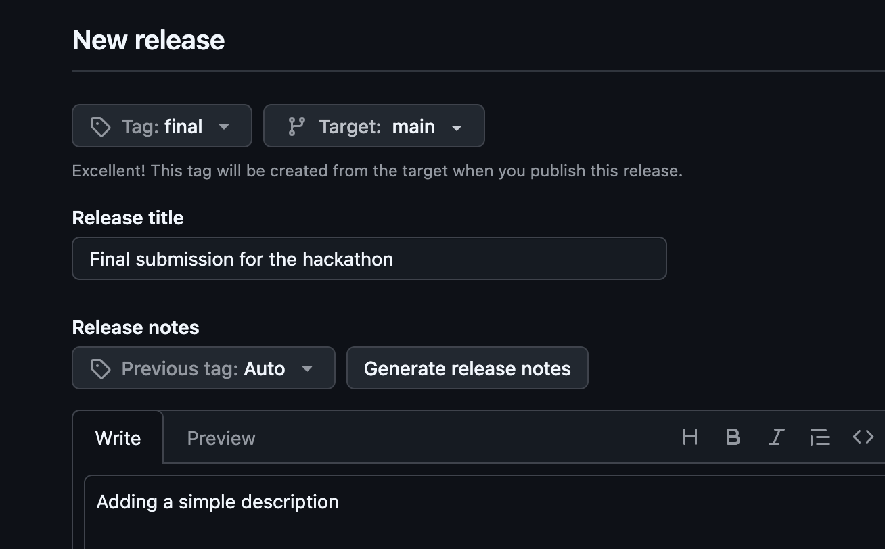
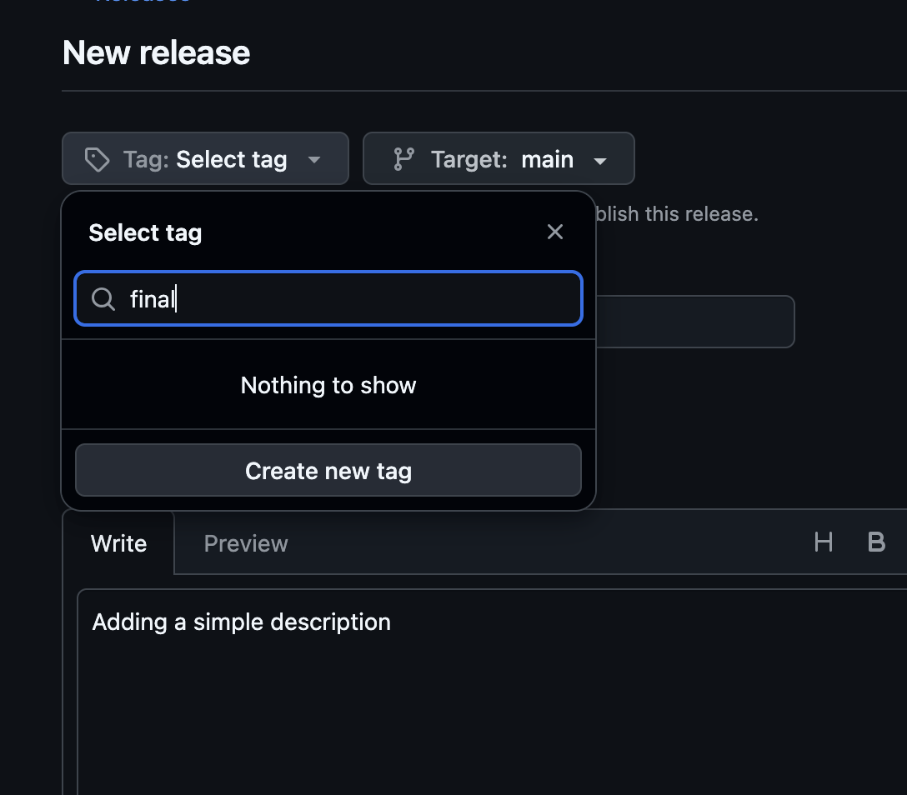
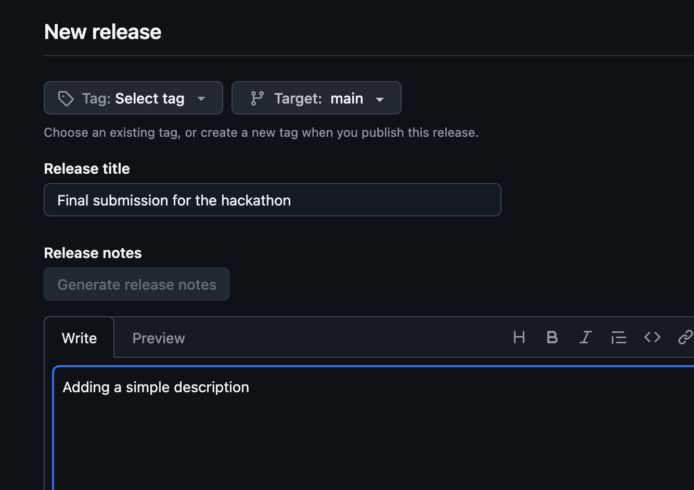
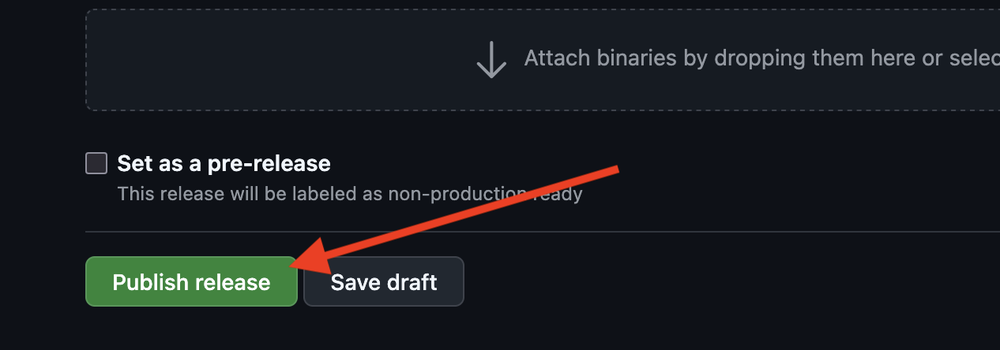

# How to submit your project

To submit your project it is required to create a new release using **Github Releases**.  
This will be used to know the exact version that will be judged.

## Make Sure Your Repository is Up to Date

Your github repository should have the latest commit that needs to be evaluated.  
To ensure it use the following commands

```shell
# ensure the latest version is committed
git commit -m "...comment..."
git push 
```

This last commit must then be tagged with the tag \`final\`, which creations will be shown later.

## Creation of a tag with Git command line

A **Tag** created using the Git command line needs to then be pushed on the repository.  
This can be done by using the following commands:

```shell
# add the 'final' tag and push it
git tag final
git push origin --tags
```

After its creation it is recommended to create a new release to make it easily accessible.

Important: the tag name to be submitted is **final**, all lowercase, no quotes, no whitespaces, no other characters, and it must be associated with the commit to be evaluated.

## Creation of the Release with Github interface

1. Go to the repository on GitHub.  
2. Click on **Create a new Release** in the **Releases** tab (on the right-hand side, below the repo description).

4. Fill out the release informations 
5. Select the tag **final** from which the release will be created (click on **Create new tag** if it wasn’t created from the command line)
6. The release form should look like this 
7. Click on **Publish release** to finish the creation and submit for assessment
